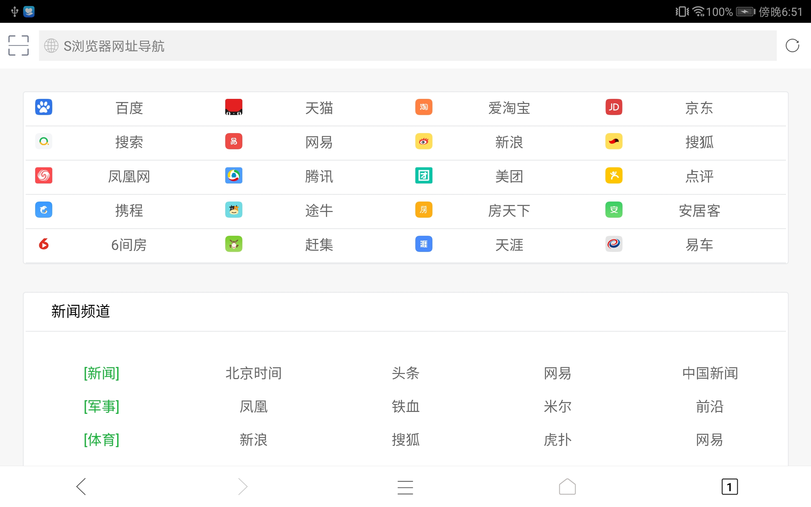
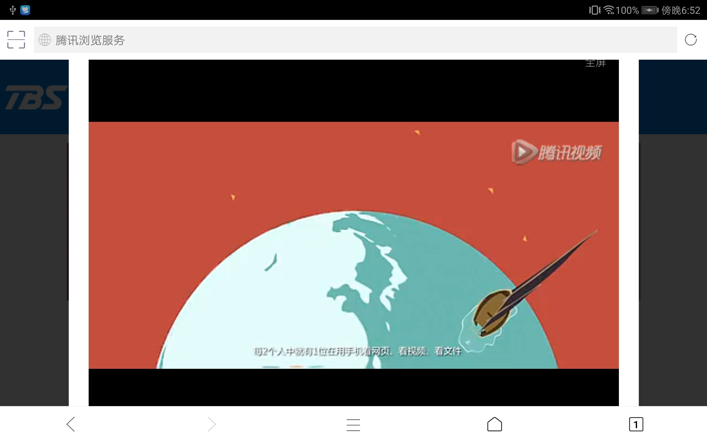

# YBroswer
YBrower是基于腾讯X5内核实现的浏览器DEMO

本产品基于[Ericsongyl/S-Browser: Android：S-Browser（S浏览器，S的意义：sensitive-灵敏、灵活，super-超级，simple-简单、简洁），V2.0改用TBS X5的内核，app体积大大减小，只有1.4M左右，用户体验大大提升，页面加载很快；而原来V1.0使用Chromium_WebView内核，基于TintBrowser框架实现的，app有34M左右。 ](https://github.com/Ericsongyl/S-Browser)

### 项目截图

App体验链接:[app-release.apk](https://github.com/simplebam/YBroswer/releases/download/v1.0/app-release.apk)

## 前言
* 最近由于 “红芯浏览器内嵌Chrome内核都可以融资2.5亿元” 事件引起了巨大的轰动，不少
  朋友想起了我们芯片事件，其实做一个浏览器内核跟做操作系统的难度是差不多的，国内
  互联网公司比如奇虎360的安全/极速浏览器、腾讯的QQ浏览器、百度的百度浏览器等都是基于
  Blink 引擎进行二次优化，其中最好用的就是阿里的UC内核以及腾讯的X5内核。
* 身为阿里粉丝的我，在2017年中听 UC宣称向开发者开放了UC内核的时候便想去尝试，但截
  至到 2018.08.29都没有找到相关文档。
* 腾讯的 X5内核虽然很多坑，但相较于CrossWalk还是很轻，是一个差强人意的产品。X5文档写的
  比较差，希望腾讯以后可以优化一下。

## 官方工具
* X5内核检查工具：[[TBS] X5内核加载问题自动检测工具发布啦 - QQ浏览器移动产品论坛 ](http://bbs.mb.qq.com/thread-1944983-1-1.html)

## 参考的开源库
* [X5 浏览器内核调研报告 - 简书 ](https://www.jianshu.com/p/2a14d303308d)
  * [baishixian/X5WebEngineDemo: X5 webview demo ](https://github.com/baishixian/X5WebEngineDemo)
* [Ericsongyl/S-Browser: Android：S-Browser（S浏览器，S的意义：sensitive-灵敏、灵活，super-超级，simple-简单、简洁），V2.0改用TBS X5的内核，app体积大大减小，只有1.4M左右，用户体验大大提升，页面加载很快；而原来V1.0使用Chromium_WebView内核，基于TintBrowser框架实现的，app有34M左右。 ](https://github.com/Ericsongyl/S-Browser)
